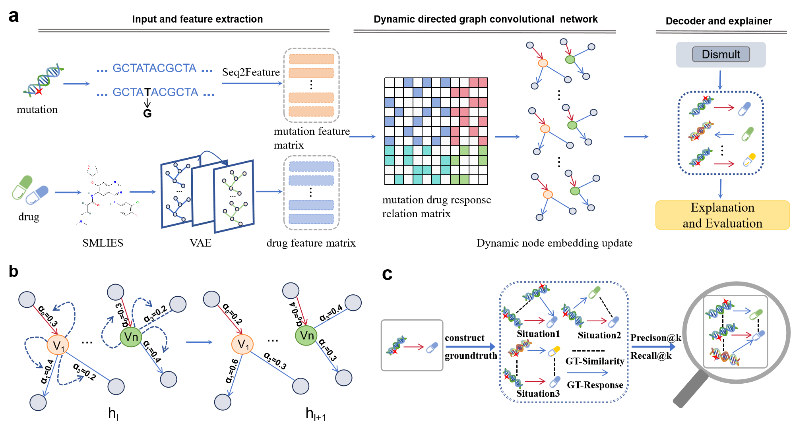

# Interpretable Dynamic Directed Graph Convolutional Network (IDDGCN) for Multi-Relational Prediction of Missense Mutation and Drug Response

'IDDGCN' uses directed graph to distinguish between sensitivity and resistance relationships, and utilizes node features to dynamically update the weights of these relationships, reflecting the specific interactions of different nodes. It also applied interpretability models to this prediction framework and proposed a method for constructing ground truth for evaluation. 

## Table of Contents
- [Framework](#framework)
- [System Requirements](#system-requirements)
- [Datasets](#datasets)
- [Run IDDGCN](#run-iddgcn)
- [Citation](#Citation)
- [References](#References)

## Framework


## System Requirements
The source code developed in Python 3.7 using tensorflow  2.7.0. The required python dependencies are given below. IDDGCN is supported for any standard computer and operating system (Windows/macOS/Linux) with enough RAM to run. There is no additional non-standard hardware requirements.
```markdown
tensorflow>=2.7.0
scipy>=1.7.3
scikit-learn>= 0.22.1
numpy>= 1.21.6
pandas>=1.1.5
h5py>=3.8.0
openpyxl>=3.1.2
PubChemPy>=1.0.4
tqdm>=4.66.1
```

## Datasets
The `datasets` directory contains all the experimental data used in IDDGCN. [MetaKB](https://search.cancervariants.org/#*)[^1].
In and folders, we have full data with five-fold cross-validation experiment for prediction part and detailed data for explanation part:
- `datasets/prediction_datasets` Contains all the data required for training IDDGCN, as well as pre-trained weights available in the subdirectory 'weights', which can be directly used for model evaluation.
- `datasets/explanation_datasets` Contains all the data needed to construct ground truth and train the interpretability models, as well as pre-constructed groundtruth and explanations generated by the interpretability models for evaluation.
## Run IDDGCN

1. **Model Training**: Run `IDDGCN.py` in the `prediction` folder to train the IDDGCN model. You can run this step to train the IDDGCN or directly proceed to step two to see the prediction evaluation results.
```markdown
cd prediction
python IDDGCN.py
```
2. **Model Evaluation**: Run `IDDGCN_eval.py` in the `prediction` folder to evaluate the prediction results.
```markdown
cd prediction
python IDDGCN_eval.py
```
3. **Ground Truth Construction**: You can use `ground_truth` in the `explanation` folder to construct ground truth, or directly use the pre-constructed groundtruth `gt_all.csv` in the `explanation/data` folder.
```markdown
cd explanation
python ground_truth.py
```
4. **Run Explanation Models**: Directly run `GnnExplainer` and `explaiNE` in the `explanation` folder to explain the prediction results, You can run this step to train these models or directly proceed to step five to see the evaluation results.
```markdown
cd explanation
python GnnExplainer.py
python explaiNE.py
```
5. **Explanation Model Evaluation**: Run `eval_test.py` in the `explanation` folder to evaluate the explanation models.  
```markdown
cd explanation
python eval_test.py
```
## Citation
if you use IDDGCN, please cite our paper:"Interpretable Dynamic Directed Graph Convolutional Network for Multi-Relational Prediction of Missense Mutation and Drug Response"[^2]
## References
[^1]: <a href="https://www.nature.com/articles/s41588-020-0603-8" target="_blank" rel="noopener noreferrer">Wagner A H, Walsh B, Mayfield G, et al. A harmonized meta-knowledgebase of clinical interpretations of somatic genomic variants in cancer. *Nature Genetics*, 2020, 52(4): 448-457</a>
[^2]:Qian Gao, Tao Xu, Xiaodi Li, Wanling Gao and Zhenyu Yue*. Interpretable Dynamic Directed Graph Convolutional Network for Multi-Relational Prediction of Missense Mutation and Drug Response, 2024, Submitted.
